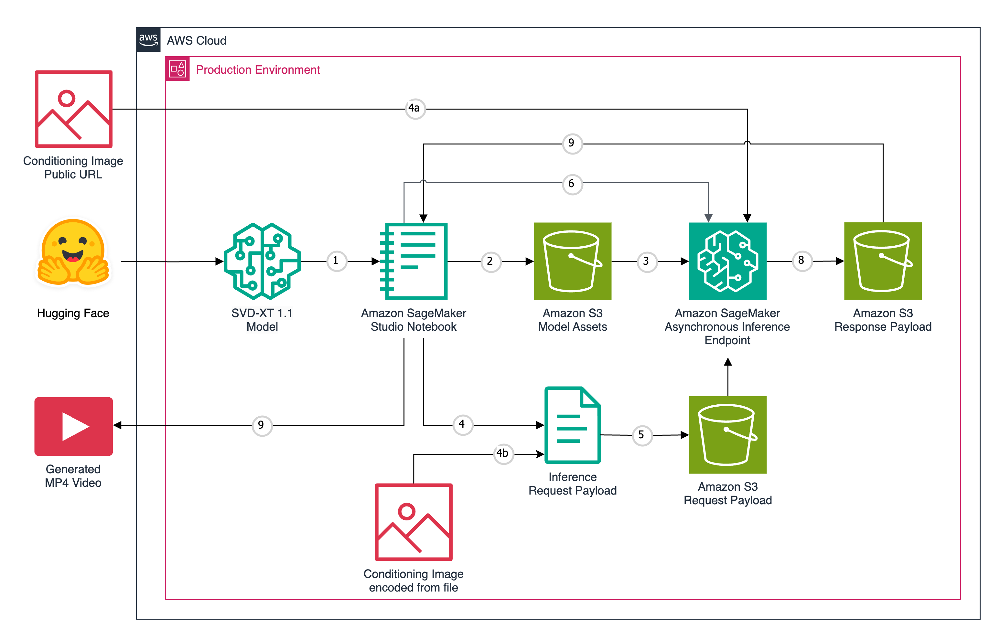
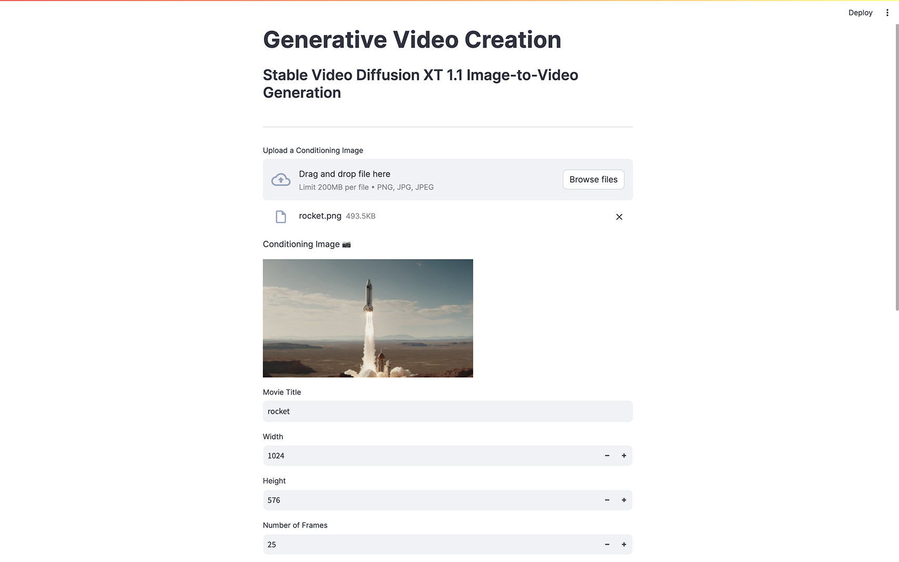

# Stable Video Diffusion XT 1.1 on Amazon SageMaker

Stability AI's [Stable Video Diffusion XT (SVT-XT) 1.1](https://stability.ai/stable-video) foundation model, available on [Hugging Face](https://huggingface.co/stabilityai/stable-video-diffusion-img2vid-xt-1-1), is a diffusion model that takes in a still image as a conditioning frame and generates a short 4 second video. The notebook walks through configuring, creating, and invoking an [Asynchronous Inference Endpoint](https://docs.aws.amazon.com/sagemaker/latest/dg/async-inference.html) backed by the SVT-XT-1.1 foundation model on Amazon SageMaker.

For more information on using this repository, read this blog post by Gary Stafford: [Generative AI Videos with Stability AI’s Stable Video Diffusion XT using Asynchronous Inference on Amazon SageMaker](https://garystafford.medium.com/generative-ai-videos-with-stability-ais-stable-video-diffusion-xt-using-asynchronous-inference-on-6810e0a7cab6).

## Jupyter Notebooks

- **Setup and Dependencies**: [This notebook](notebook_setup.ipynb) installs all needed dependencies, downloads and bundles the model artifacts, and deploys an Amazon SageMaker endpoint ready to use by the following notebooks.

- **Async Inference**: [This notebook](notebook_async_inference.ipynb) invokes the model using either a publicly available image URL or an embedded/encoded image from a local file.

## Architecture



## Streamlit Application

The project now includes an interactive Streamlit application to generate the videos.

Make sure you have set up the local environment and installed the required Python packages:

```sh
python3 -m venv venv

source venv/bin/activate

python3 -m pip install -r local_requirements.txt -Uq
```

The Streamlit application can be started with the following command:

```sh
streamlit run app.py --server.runOnSave true
```



## Example Videos

You can find example videos on these reference pages generated by Stability AI:

- https://stability.ai/stable-video
- https://huggingface.co/stabilityai/stable-video-diffusion-img2vid-xt
- https://huggingface.co/stabilityai/stable-video-diffusion-img2vid-xt-1-1

## References

- https://github.com/aws-samples/amazon-sagemaker-asynchronous-inference-computer-vision/blob/main/mask-rcnn-async-inference.ipynb
- https://github.com/huggingface/diffusers/issues/6956
- https://github.com/huggingface/notebooks/blob/main/sagemaker/23_stable_diffusion_inference/sagemaker-notebook.ipynb
- https://github.com/philschmid/huggingface-inferentia2-samples/blob/main/stable-diffusion-xl/sagemaker-notebook.ipynb
- https://github.com/Stability-AI/generative-models/blob/main/scripts/sampling/simple_video_sample.py
- https://huggingface.co/docs/diffusers/en/using-diffusers/svd
- https://huggingface.co/docs/sagemaker/inference#create-a-model-artifact-for-deployment
- https://huggingface.co/stabilityai/stable-video-diffusion-img2vid-xt/tree/main
- https://sagemaker.readthedocs.io/en/stable/api/inference/async_inference.html
- https://www.philschmid.de/sagemaker-stable-diffusion

## Security

See [CONTRIBUTING](CONTRIBUTING.md#security-issue-notifications) for more information.

## License

This library is licensed under the MIT-0 License. See the LICENSE file.
